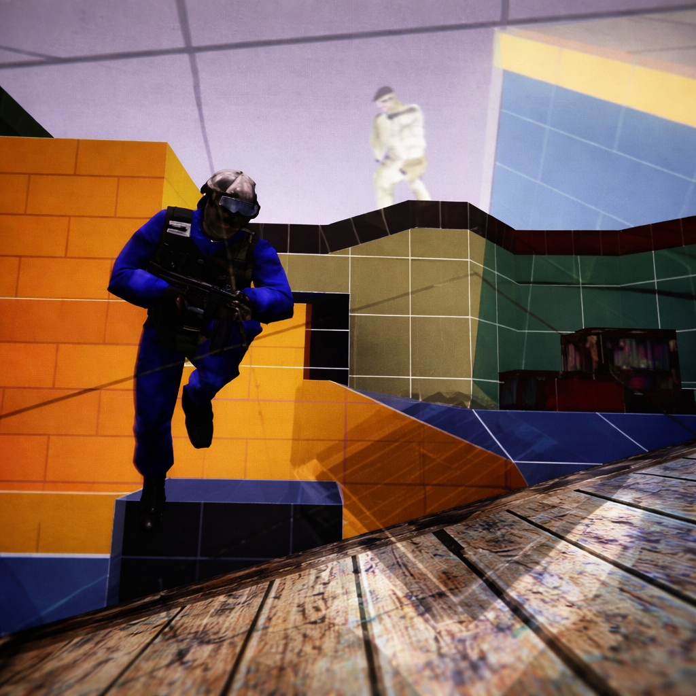
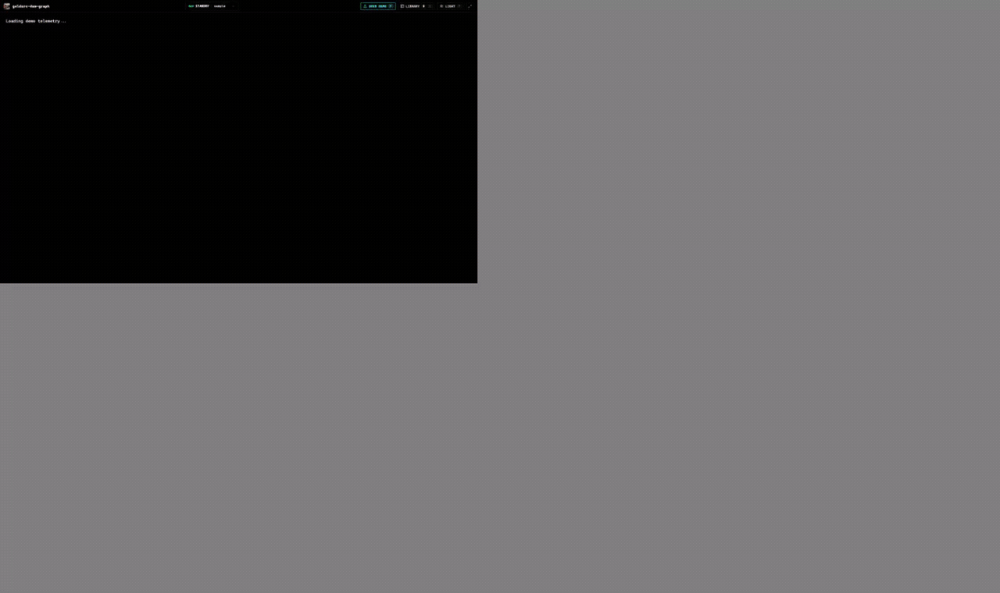
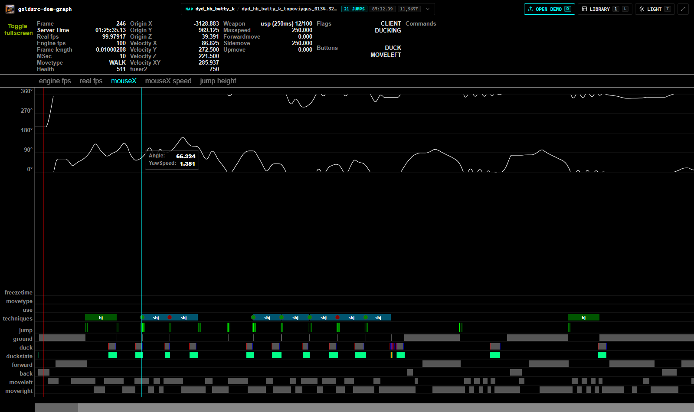
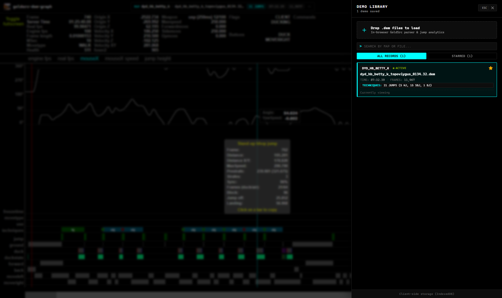
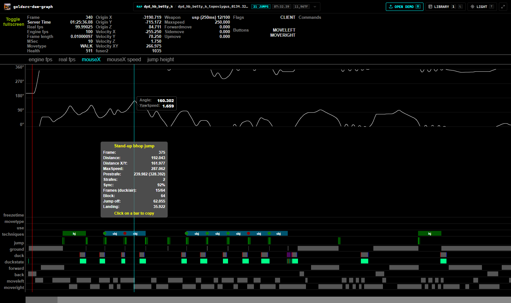
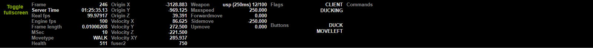
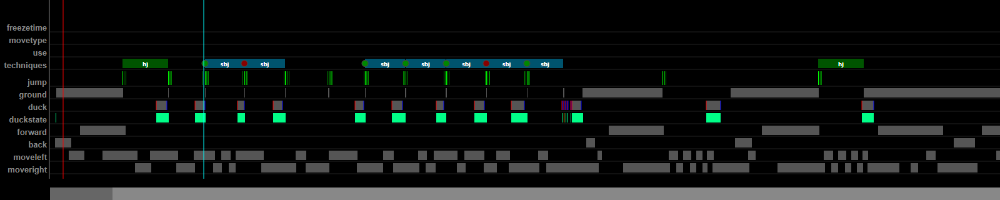

<p align="center">
  <a href="https://miyakejima.github.io/goldsrc-dem-graph/">
    
  </a>
</p>

<h1 align="center">goldsrc-dem-graph</h1>

<p align="center">
  <strong>Offline In-Browser GoldSrc Demo Telemetry Analyzer & 1:1 Unique-KZ Graph Visualizer</strong><br>
  Instant client-side demo parsing, movement analytics, and frame-by-frame physics telemetry for Half-Life 1 and Counter-Strike 1.6.
</p>

<p align="center">
  <a href="https://miyakejima.github.io/goldsrc-dem-graph/"></a>
  
  
  
  
  
</p>

<p align="center">
  <a href="https://miyakejima.github.io/goldsrc-dem-graph/"><strong>Launch Live App</strong></a> ·
  <a href="#why-this-exists">Why This Exists</a> ·
  <a href="#interactive-telemetry-demo">Interactive Demo</a> ·
  <a href="#workstation-previews">Workstation Previews</a> ·
  <a href="#telemetry--metrics">Telemetry & Metrics</a> ·
  <a href="#jump-techniques-parity">Jump Techniques</a> ·
  <a href="#keyboard-ergonomics">Keyboard Controls</a> ·
  <a href="#architecture">Architecture</a> ·
  <a href="#local-development">Local Development</a>
</p>

<p align="center">
  Open and analyze demos directly in your browser with zero installation:<br>
  <a href="https://miyakejima.github.io/goldsrc-dem-graph/"><strong>https://miyakejima.github.io/goldsrc-dem-graph/</strong></a>
</p>

---

## Interactive Telemetry Demo

<p align="center">
  <a href="https://miyakejima.github.io/goldsrc-dem-graph/">
    
  </a>
</p>

---

## Why This Exists

Analyzing GoldSrc Kreedz and Bhop runs historically required running Counter-Strike 1.6 with specialized AMX Mod X server plugins (`uq_jumpstats`, `kz_ljs_xm`), setting up heavy offline recording suites, or uploading private demo files to third-party web services.

**goldsrc-dem-graph** reconstructs the authentic Unique-KZ telemetry environment inside the browser:

- **100% Client-Side Execution**: Powered by `@kz-rebuild/parser/browser`, binary demo packets are parsed in-memory using WebAssembly and Node-compatible typed arrays. Parsing 100,000+ frames completes in ~15 milliseconds.
- **Zero Server Dependencies**: Demos are never sent over the network. All movement analytics, strafe synchronization measurements, and technique classifications execute entirely on your machine.
- **Offline Storage**: The built-in Demo Library uses browser-native `IndexedDB` to cache parsed runs locally, enabling instant offline access, search filtering, and technique auditing.
- **Exact Visual Parity**: Mapped 1:1 against the original Unique-KZ canvas geometry, curve colors, 12-lane input matrix, and 5-column HUD telemetry panel.

---

## Workstation Previews

All screenshots reflect the default **True AMOLED `#000000` Black Theme**, engineered for exact color parity with the visualizer canvas.

### Full Workstation Overview (AMOLED Dark)

Complete visualizer workstation featuring raw repository branding, active demo readout pill, 5-column live telemetry HUD, waveform graphs, and 12-lane input action timeline:



### In-Browser Demo Library Archive

Slide-over storage vault powered by IndexedDB. Features drag-and-drop ingestion, instant monospace search filtering, favorite tagging, and technique breakdown tags:



### Interactive Jump Technique Popup

Clicking any technique block inside the timeline displays an instant breakdown of jump metrics (takeoff frame, landing frame, 2D/3D distance, prestrafe, maxspeed, strafe count, sync percentage, air frames, duck frames, and block distance):



### 5-Column Live Telemetry HUD

Sub-millisecond frame telemetry reflecting the exact player state at the cursor position:



### 12-Lane Input Action Matrix & Jump Techniques

Authentic action bars with dual duckstate rendering, ground contact, jump commands, directional movement (`+forward`, `+back`, `+moveleft`, `+moveright`), and technique blocks with ideal bhop timing dots:



---

## Telemetry & Metrics

### 5-Column HUD Layout

| Column | Telemetry Field | Description |
| :--- | :--- | :--- |
| **Col 1** | `Frame` | Current demo frame index |
| | `Server Time` | In-engine server timestamp formatted as `MM:SS.ms` |
| | `Real fps` | Frametime-derived client rate (`1 / frametime`) |
| | `Engine fps` | Engine command rate (`1000 / msec`) |
| | `Frame length` | Raw frame duration in seconds (e.g. `0.01000208`) |
| | `MSec` | Milliseconds per tick (`cmd.msec`) |
| | `Movetype` | Engine player movetype (`WALK`, `FLY`, `NOCLIP`, `LADDER`) |
| | `Health` | Player health pool (e.g. `511` on Kreedz training maps) |
| **Col 2** | `Origin X, Y, Z` | Player bounding box coordinates in GoldSrc world units |
| | `Velocity X, Y, Z` | Per-axis player velocity vectors |
| | `Velocity XY` | Horizontal resultant planar velocity ($\sqrt{v_x^2 + v_y^2}$) |
| | `fuser2` | Engine stamina / duck slowdown recovery accumulator |
| **Col 3** | `Weapon` | Active weapon entity and cycle time (e.g. `usp (250ms) 12/100`) |
| | `Maxspeed` | Movement speed cap (e.g. `250.000` u/s) |
| | `Forwardmove` | Raw engine analog forward movement command (`-400` to `+400`) |
| | `Sidemove` | Raw engine analog lateral movement command (`-400` to `+400`) |
| | `Upmove` | Vertical movement command (`+jump` / `+duck` vector) |
| **Col 4** | `Flags` | Engine player state bits (`FL_ONGROUND`, `FL_DUCKING`, etc.) |
| | `Buttons` | Active player input bitmasks (`IN_JUMP`, `IN_DUCK`, `IN_MOVELEFT`, etc.) |
| **Col 5** | `Commands` | Recorded console command invocations |

### Interactive Waveform Curves

- **`mouseX`**: Continuous player yaw angle over time. Features 180° discontinuity phase unwrapping to prevent vertical jump artifacts during complete mouse spins.
- **`mouseX speed`**: Per-frame angular yaw velocity ($\Delta \text{yaw} / \text{tick}$). Exposes strafe rhythm, oscillation symmetry, and wrist correction harmonics.
- **`real fps`**: Real-time rendering delta curve. Immediately exposes frame drops, stutter, or uneven frametime spikes.
- **`engine fps`**: Underlying engine tick frequency markers (100, 83, 50, 25 fps thresholds).
- **`jump height`**: Real measured player $Z$-axis elevation change vs. theoretical parabolic ballistic trajectory.

---

## Jump Techniques Parity

The analytics engine dynamically detects and classifies jumps according to AMX Mod X Kreedz standards:

| Code | Technique Name | Color | Conditions & Physics Rules |
| :--- | :--- | :--- | :--- |
| `lj` | Long Jump | `#228b22` | Takeoff from ground run, flat elevation ($\| \Delta z \| < 2.0$), $\text{FOG} > 3$ |
| `hj` | High Jump | `#005500` | Takeoff from ground run, vertical elevation drop ($\| \Delta z \| \ge 2.0$) |
| `bj` | Bhop Jump | `#36648b` | Bhop landing-to-takeoff transition ($\text{FOG} \le 3$), ducking at takeoff |
| `sbj` | Standup Bhop Jump | `#00546e` | Bhop transition ($\text{FOG} \le 3$), standing (unducked) at takeoff |
| `wj` | Weird Jump | `#8b3a3a` | Fall from elevation followed by bhop takeoff |
| `cj` | Count Jump | `#daa520` | Single pre-jump duck tap before jumpoff |
| `scj` | Standup Count Jump | `#a0522d` | Standup landing following count jump sequence |
| `dcj` | Multi Count Jump | `#ab7d0c` | Multiple duck taps ($\ge 2$) before takeoff |
| `dscj` | Multi Standup Count Jump | `#844213` | Standup landing following multi count jump sequence |
| `ldj` | Ladder Jump | `#1acdb7` | Takeoff executed from a ladder surface |
| `slj` | Slide Long Jump | `#1e7878` | Takeoff executed from an angled surf / slide plane |

### Bhop Timing Indicators
- **Green Dot**: Ideal bhop timing ($\text{FOG} \le 2$ ticks, minimum speed loss).
- **Red Dot**: Non-ideal bhop timing ($\text{FOG} = 3$ ticks, measurable velocity friction).

---

## Keyboard Ergonomics

All visualizer operations can be controlled entirely via keyboard shortcuts:

| Key | Action |
| :--- | :--- |
| **`[O]`** | Trigger local `.dem` file selector |
| **`[L]`** | Toggle Demo Library drawer |
| **`[T]`** | Toggle theme (True AMOLED Dark / Clean Light) |
| **`[F]`** | Toggle Fullscreen view |
| **`[Esc]`** | Close open drawer or dismiss jump stats modal |
| **`[Space]`** | Play / Pause real-time playback |
| **`[Left]` / `[Right]`** | Scrub timeline frame-by-frame |
| **`[A]` / `[D]`** | Alternative frame scrubbing controls |
| **`Shift` + `[Arrow]`** | Fast scrubbing (10 frames per step) |
| **`Ctrl` + `[Arrow]`** | Ultra-fast scrubbing (100 frames per step) |
| **`[Home]`** | Jump directly to timer start frame |
| **`[End]`** | Jump directly to timer stop frame |

---

## Architecture

The project is structured as an integrated monorepo:

```
goldsrc-dem-graph/
├── apps/
│   ├── web/                     # React 19 + Vite frontend (deployed to GitHub Pages)
│   │   ├── src/
│   │   │   ├── App.tsx          # 1:1 Unique-KZ graph visualizer & HUD telemetry
│   │   │   ├── clientParser.ts  # In-browser binary demo parser & analytics bridge
│   │   │   ├── components/      # Clean UI components (AppHeader, DemoLibrary, ThemeToggle)
│   │   │   ├── storage/         # IndexedDB client-side demo persistence
│   │   │   └── styles.css       # True AMOLED `#000000` & Clean Light CSS design system
│   │   └── public/
│   │       ├── icon.png         # Kreedz player icon & browser favicon
│   │       └── sample-dataset.json # Pre-bundled static dataset for instant first-load
│   └── api/                     # Optional Node.js standalone backend service
├── packages/
│   ├── parser/                  # Binary GoldSrc demo protocol parser (Node & Browser)
│   ├── analytics/               # AMXX uq_jumpstats & kz_ljs_xm movement analytics engine
│   ├── shared-types/            # Strict TypeScript contracts across pipeline
│   └── physics/                 # GoldSrc pm_shared player simulation & collision models
└── docs/
    ├── goldsrc-dem-graph-demo.gif  # High-quality animated demonstration
    ├── goldsrc-dem-graph-demo.webp # High-performance animated WebP demo
    └── screenshots/             # High-resolution documentation captures
```

---

## Local Development

### Prerequisites
- Node.js 20+
- npm 10+

### Setup
```bash
# 1. Clone the repository
git clone https://github.com/miyakejima/goldsrc-dem-graph.git
cd goldsrc-dem-graph

# 2. Install dependencies
npm install

# 3. Start local development server
npm run dev
```

### Production Build & Local Preview
```bash
# Build web package
npm run build --workspace=@kz-rebuild/web

# Preview production build locally
npm run preview --workspace=@kz-rebuild/web
```

### Deployment to GitHub Pages
The web application deploys to the `gh-pages` branch using `gh-pages`:
```bash
npm run deploy
```

---

## License

[ISC](LICENSE) License. Built for the GoldSrc, Counter-Strike 1.6, and Kreedz speedrunning communities.
