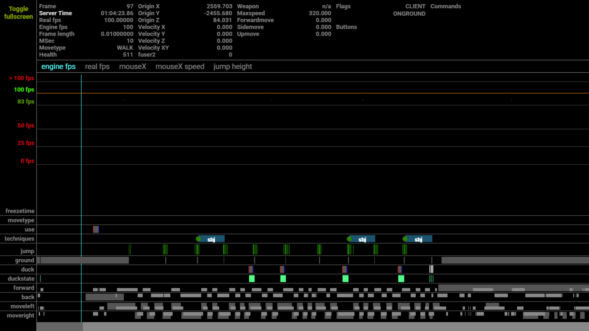
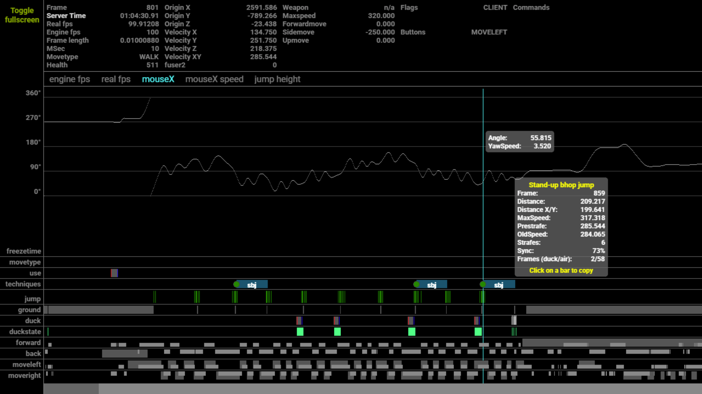
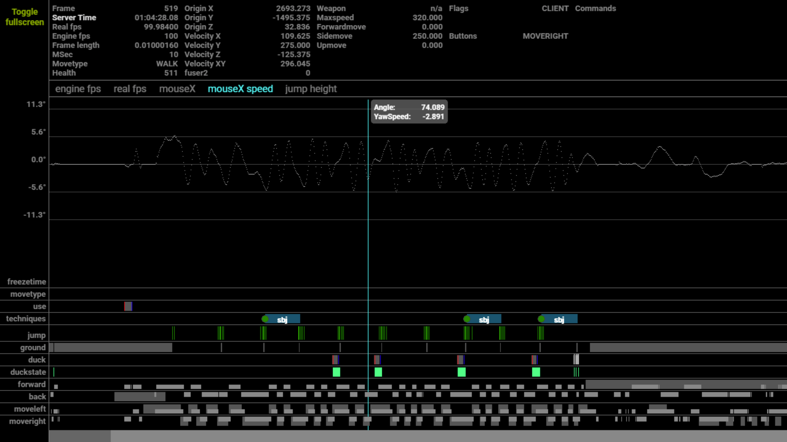
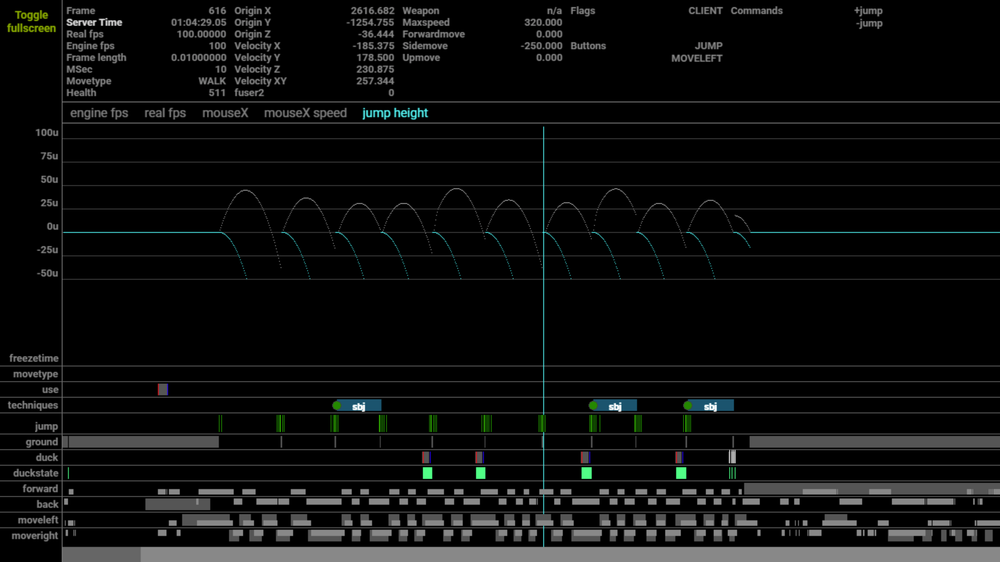

# GoldSrc Demo Graph

Offline `.dem` file analyzer for CS 1.6 KZ/bhop demos. Parses GoldSrc demo frames locally via a Rust binary and renders the full interactive graph (engine fps, mouseX, mouseX speed, jump height, strafe data) in the browser — no upstream API, no login required.

Built by reverse engineering the `demo.unique-kz.net` graph renderer and pairing it with a purpose-built Rust parser for the GoldSrc demo binary format.

---

## Screenshots

**Engine FPS — frame timeline with technique markers**


**MouseX — yaw angle over time with per-jump breakdown**


**MouseX Speed — per-frame yaw delta**


**Jump Height — parabolic arc per bhop**


---

## What It Does

1. Accept a local `.dem` file upload in the browser
2. Invoke the local Rust parser binary to extract frame data into a graph payload
3. Render the full interactive graph UI in-browser (engine fps, real fps, mouseX, mouseX speed, jump height)
4. Display per-jump technique information (stand-up bhop, duckbug, edgebug, slidebug, longjump) with distance, prestrate, strafes, sync, and air frames
5. Export deterministic CSV datasets for offline strafe analysis

No network requests are made during normal use. The Rust parser is built locally on first run via Cargo.

---

## Stack

| Layer | Technology |
|---|---|
| Frontend | Vite + vanilla JS + [PixiJS](https://pixijs.com/) 7 |
| Dev server | Express 5 + Vite middleware |
| Demo parser | Rust (`hldemo` crate) → JSON payload |
| Export | CSV (jumps, frames, strafe-helper dataset) |

---

## Requirements

- **Node.js** 20+
- **npm**
- **Rust + Cargo** (installed via [rustup](https://rustup.rs/))
- Windows, macOS, or Linux with a local browser

See [REQUIREMENTS.md](REQUIREMENTS.md) for the full setup checklist.

---

## Quick Start

```bash
# 1. Install JS dependencies
npm install

# 2. Start the local app (builds Rust parser on first run)
npm run dev
```

Open [http://localhost:5173](http://localhost:5173), drop in a `.dem` file, click **Parse + Load Graph**.

---

## Graph Views

| Tab | What it shows |
|---|---|
| `engine fps` | Engine FPS per frame with 100 fps / 83 fps / 50 fps / 25 fps reference lines |
| `real fps` | Real (client) FPS per frame |
| `mouseX` | Absolute yaw angle over time — click any technique bar for full jump stats |
| `mouseX speed` | Per-frame yaw delta (degrees/frame) — shows strafe oscillation pattern |
| `jump height` | Parabolic Z-height arc for each bhop with the bhop baseline in cyan |

### Technique bar rows (bottom panel)

| Row | Meaning |
|---|---|
| `techniques` | Detected technique per jump: `sbj` (stand-up bhop), `dj` (duck jump), `lj` (long jump), etc. |
| `jump` | Frame-level jump button presses |
| `ground` | Ground contact frames |
| `duck` / `duckstate` | Duck button and duck state transitions |
| `forward` / `back` | Forwardmove direction |
| `moveleft` / `moveright` | Sidemove direction |

---

## CSV Export

The **Export Everything CSV Pack** button downloads a zip containing all frame data for offline analysis.

---

## Black-Box Toolkit (optional)

`tools/blackbox/` contains parity scripts for comparing local parser output against upstream API responses. Requires environment variables:

```bash
set UNIQUE_AUTH_TOKEN=your_token
set UNIQUE_CSRF_TOKEN=optional_csrf   # optional
```

| Script | Purpose |
|---|---|
| `bb:upload` | Upload a folder of demos to the upstream API |
| `bb:fetch` | Fetch upstream graph payloads for uploaded demos |
| `bb:parse-local` | Run the local parser on the same demos |
| `bb:analyze` | Compare local vs upstream payloads, produce calibration report |
| `bb:analyze-bars` | Bar-level parity report |
| `bb:analyze-canonical` | Canonical parity report |
| `bb:compare-demo` | Side-by-side diff for a single demo |

Generated output belongs in `re_data/` which is intentionally kept out of source control.

---

## Project Layout

```
unique-graph-local-tester/
├── src/
│   ├── main.js                  # App entry — file upload, UI boot, export dispatch
│   ├── style.css
│   ├── upstream/                # Extracted graph renderer (PixiJS-based)
│   │   ├── graph/               # Core graph rendering logic
│   │   │   ├── bars/            # Technique / jump / state bar renderers
│   │   │   ├── graphics/        # Overlay renderers (duck, ground, forward, etc.)
│   │   │   └── models/          # Graph data models
│   │   └── pages/demo/          # Demo page shell
│   └── export/
│       ├── csv-pack.js          # Full CSV pack export
│       └── strafe-helper-dataset.js  # Strafe-helper CSV export
├── server/
│   └── dev-server.js            # Express + Vite dev server; /api/parse-dem endpoint
├── parser-rs/
│   ├── Cargo.toml               # hldemo + serde_json
│   └── src/main.rs              # GoldSrc .dem → graph JSON payload
├── tools/
│   ├── blackbox/                # Parity and calibration scripts
│   └── smoke-test-csv-pack.mjs  # CSV export smoke test
├── docs/
│   ├── architecture.md
│   ├── blackbox-tooling.md
│   └── screenshots/
├── re_data/                     # Generated workspace — not committed
└── vite.config.js
```

---

## How the Parser Works

The Rust binary reads a GoldSrc `.dem` file using the [`hldemo`](https://crates.io/crates/hldemo) crate, walks every demo frame, and emits a JSON payload consumed by the graph renderer. The parser is built automatically by the dev server on first run if no binary is present.

```
.dem file → hldemo frame iterator → per-frame state extraction → JSON → graph renderer
```

---

## License

ISC — see [LICENSE](LICENSE).
